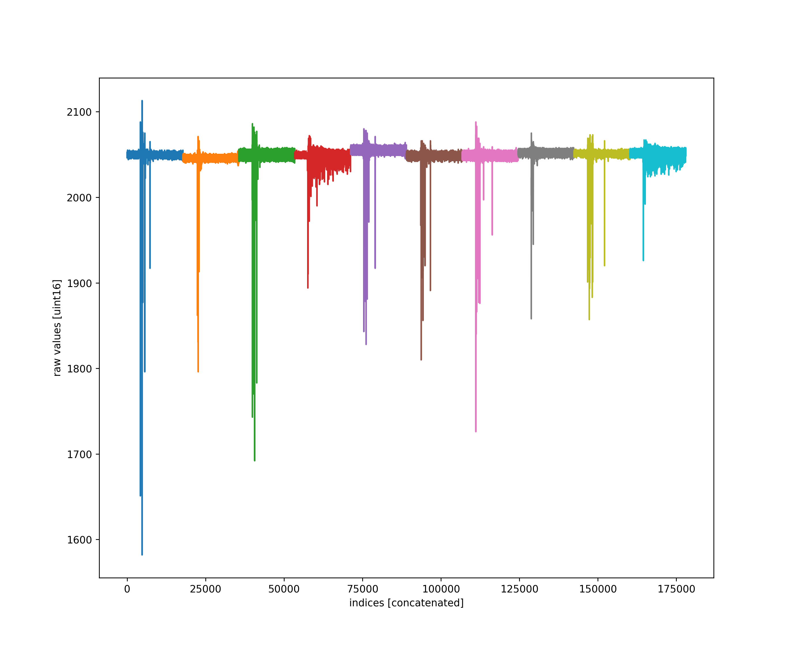
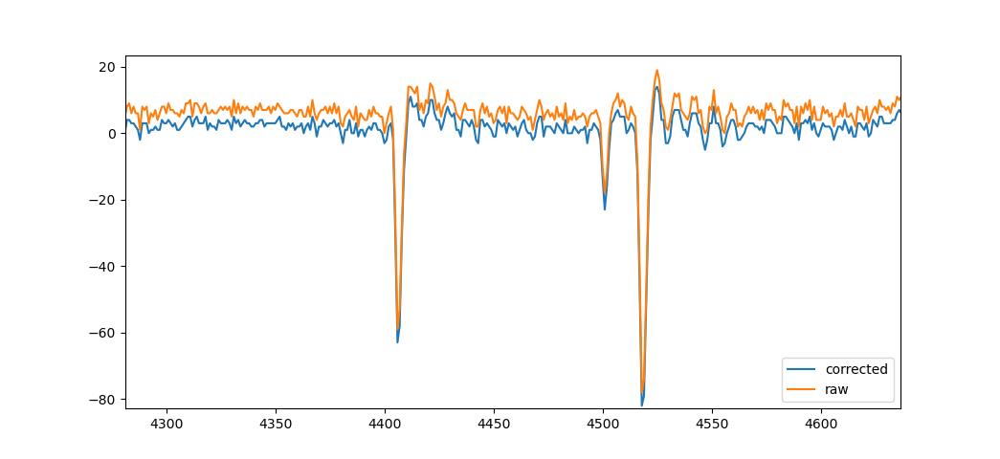

# Raw waveforms
Mostly this is to get everyone to see we are using very little of the uint16 bit-depth for our waveforms in abaco high sample rate digitizers (hsd).



## Updated for Christos.
src/waves2h5.py calls processChristos() which adds every raw waveform along with the adc baseline corrected, and the corresponding logic vector.  
This is done by including the Port.addeverysample() method to processChristos().  

This example is from file ```/reg/data/ana16/tmo/tmox42619/scratch/ryan_output_Christos/h5files/waves.tmox42619.run_084.h5```

# Running on psana
Setup the config file (```expname.configs.h5```) in the scratch directory for Christos.  The configs are hard coded in ```/src/set_configs.py```.  
expname for the CookieBox beamtime is ```tmox42619```
valid run numbers for e.g. Neon are in runs 83 through 88, pick one or two to run, they should get saved as seperate files.
When running try only the first couple hundred shots or so, basically the result will be about three times bigger than it needs to be since we save all three, the raw, the baseline (and adc) corrected, and the logic version that we scan for the edges.
```bash
/cds/home/c/coffee/analysis_2023/x42619/src/set_configs.py /reg/data/ana16/tmo/tmox42619/scratch/ryan_output_Christos/h5files/tmox42619.configs.h5
```
